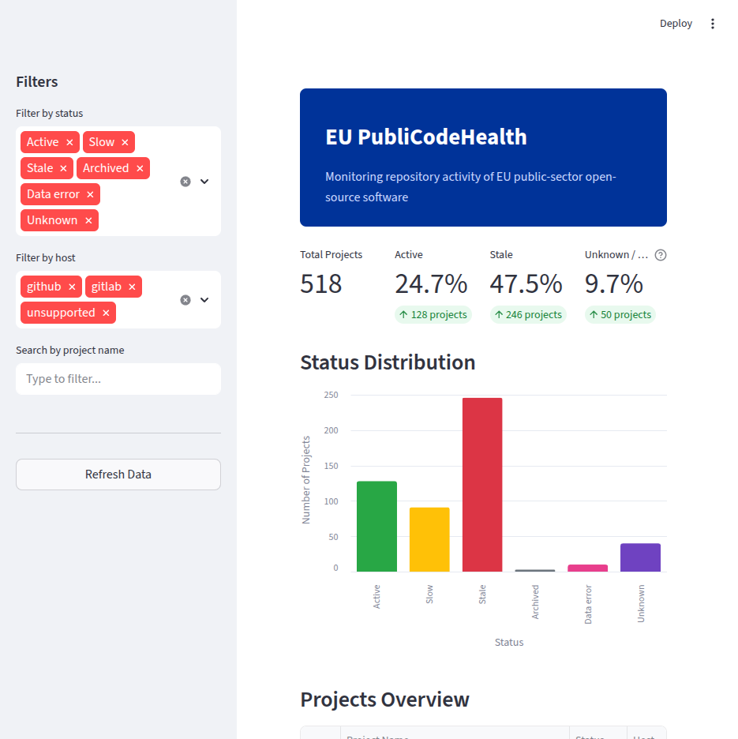
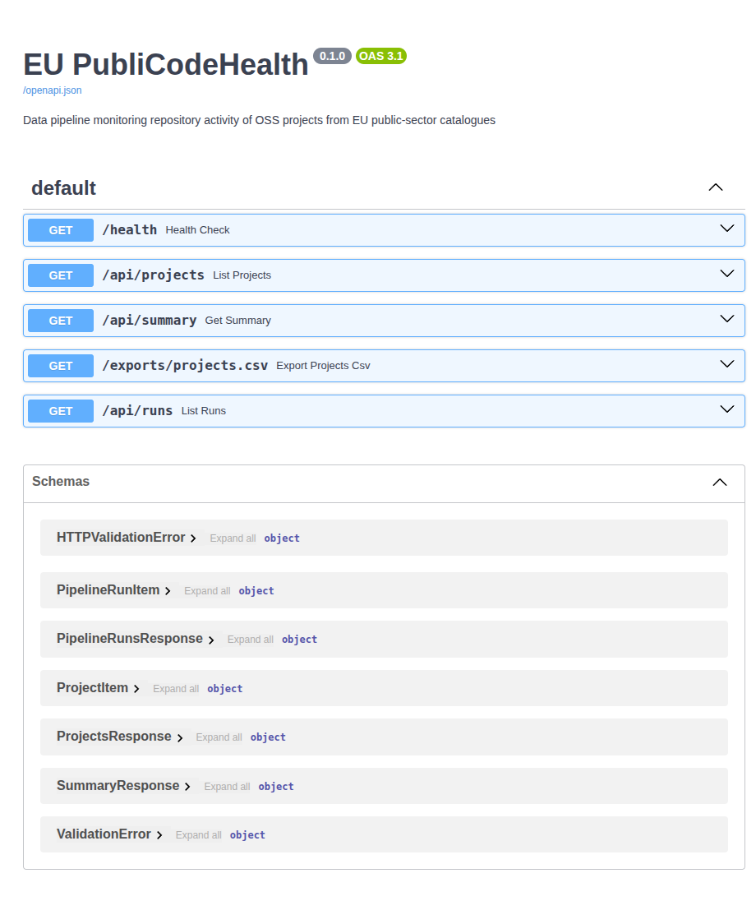
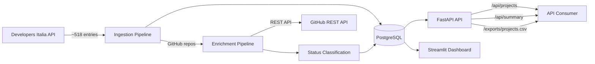
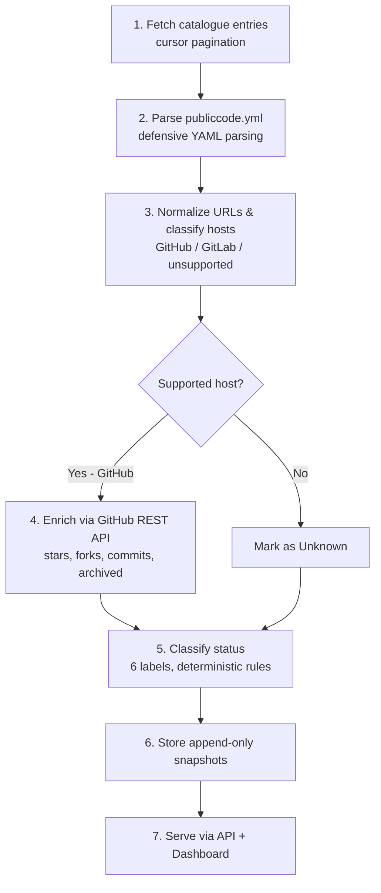
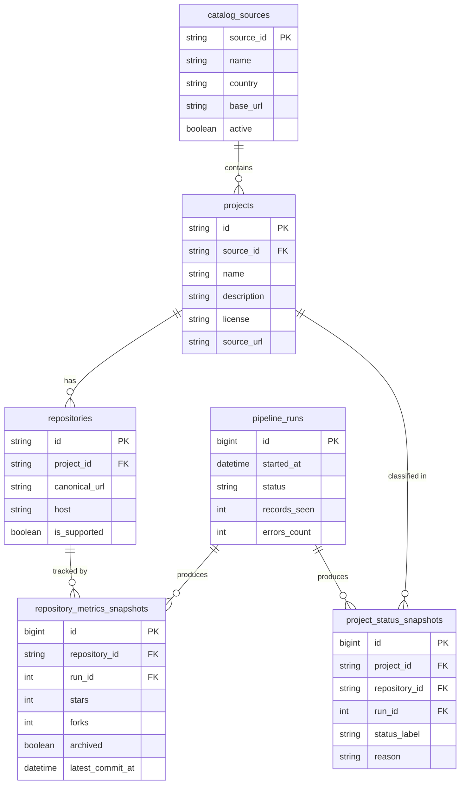

# EU PubliCodeHealth

> A reproducible data pipeline monitoring repository activity of open-source software listed in EU public-sector catalogues.


## What It Does / Doesn't Do

**Measures** — Repository activity: commit frequency, archival status, stars, forks, and basic GitHub engagement metrics. Classifies ~518 open-source projects from Developers Italia into six deterministic status labels.

**Does NOT measure** — Code quality, security vulnerabilities, dependency health, license compliance, or any form of software assessment. This is an activity monitor, not a quality gate.

## Screenshots

<table>
  <tr>
    <td><b>Streamlit Dashboard</b></td>
    <td><b>FastAPI Interactive Docs</b></td>
  </tr>
  <tr>
    <td></td>
    <td></td>
  </tr>
</table>

The dashboard shows KPI cards (total projects, active %, stale %, unknown/errors %), an interactive status distribution chart, a searchable/filterable project table with CSV export, data quality metrics, and pipeline run information.

## Architecture



## Data Pipeline Flow



## Quick Start

```bash
cp .env.example .env            # Set GITHUB_TOKEN
docker compose up --build       # Starts PostgreSQL + API + Dashboard + Scheduler
# API auto-runs Alembic migrations on startup
docker compose exec api python -m pipelines.run_all   # Run the pipeline
```

| Service | URL |
|---|---|
| API health check | http://localhost:8000/health |
| Interactive docs | http://localhost:8000/docs |
| Dashboard (Docker) | http://localhost:8502 |
| Dashboard (local dev) | http://localhost:8501 |

## Status Labels

| Label | Rule | Color |
|---|---|---|
| Active | Latest commit within 90 days | 🟢 Green |
| Slow | Latest commit 91–365 days ago | 🟡 Yellow |
| Stale | Latest commit >365 days ago | 🔴 Red |
| Archived | GitHub `archived` flag is true | ⚪ Gray |
| Unknown | Unsupported host or no repo URL | 🟣 Purple |
| Data error | API error from supported host | 🩷 Pink |

Labels are assigned by priority: Archived > Data error > Unknown > Active > Slow > Stale.

## API Endpoints

| Endpoint | Description |
|---|---|
| `GET /health` | Health check + DB connectivity |
| `GET /api/projects` | Project list (filter by status, host, search) |
| `GET /api/summary` | Status distribution counts + totals |
| `GET /exports/projects.csv` | Download CSV export |
| `GET /api/runs` | Pipeline run history |

All endpoints except `/health` require an `X-API-Key` header when `API_KEY` is set in the environment. See [deployment guide](docs/deployment.md) for details.

## Data Model



## Tech Stack

| Layer | Technology |
|---|---|
| Language | Python 3.12 |
| API | FastAPI + Uvicorn |
| Database | PostgreSQL 16 via SQLAlchemy 2.0 + Alembic |
| Dashboard | Streamlit + Altair |
| HTTP | httpx (async) |
| Config | pydantic-settings |
| Testing | pytest + pytest-cov + pytest-httpx |
| Linting | ruff (lint + format) |
| Type checking | mypy (strict) |
| Deployment | Docker Compose |

## Project Structure

```
app/
  api/          FastAPI routes, schemas, query builders
  core/         Config, status logic, URL normalization, sanitize, logging
  db/           SQLAlchemy models, session, Alembic migrations
connectors/     External API clients (Developers Italia, GitHub)
pipelines/      ETL steps (ingest, enrich, classify, orchestrate)
dashboard/      Streamlit dashboard
tests/          Unit + integration tests with fixtures
docs/           Methodology, data dictionary, deployment guide
```

## Testing

```bash
make test              # Full suite with coverage
make lint              # ruff check
make typecheck         # mypy strict
make check             # All of the above
```

## Key Engineering Decisions

**Simple labels, not composite scores.** A single "health score" would hide important nuances. Archived, Active, and Unknown are fundamentally different situations that deserve separate visibility. Composite scores also invite ranking comparisons that the underlying data doesn't support.

**GitHub-only enrichment for now.** GitLab has diverse self-hosted instances with different API versions — some running 14.x, some on 17.x, each with their own authentication setup. Shipping GitHub support first delivers value faster and avoids false promises about coverage.

**Append-only snapshots.** Historical data is never overwritten. Every pipeline run adds new snapshots. This seemed like extra work upfront but paid off quickly — the pipeline can be re-run safely, results are auditable, and trend analysis becomes possible without any extra design work.

**Developers Italia as sole source.** Starting with one well-documented public API avoids the complexity of multiple catalogue formats and lets the pipeline be reliable before expanding.

**No vulnerability scanning.** Catalogue metadata rarely includes exact package versions or SBOMs. Running OSV on incomplete data would produce misleading results that could be misinterpreted as security assessments.

## Documentation

- [Methodology](docs/methodology.md) — Data sources, classification rules, known limitations
- [Data Dictionary](docs/data_dictionary.md) — Every table and column explained
- [Deployment Guide](docs/deployment.md) — Docker setup and production deployment

## Development

```bash
pip install -e ".[dev]"    # Install with dev dependencies
make run                   # FastAPI on :8000
make dashboard             # Streamlit on :8501
make pipeline              # Run ingestion pipeline
make init-db               # Run Alembic migrations
```

## License

MIT
